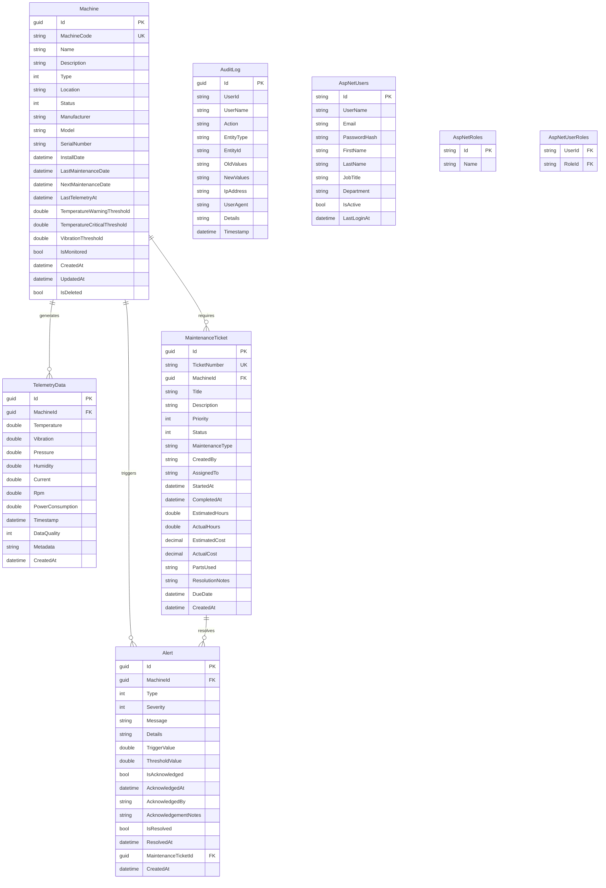

# Entity Relationship Diagram

## Mermaid ERD

## Table Descriptions

### Machines
Stores information about industrial machines being monitored. Each machine has configurable thresholds for alerting.

### TelemetryData
Time-series data collected from machine sensors. Indexed on (MachineId, Timestamp) for efficient range queries.

### Alerts
System-generated notifications when anomalies are detected. Supports acknowledgment workflow and linking to maintenance tickets.

### MaintenanceTickets
Work orders for machine maintenance. Tracks the full lifecycle from creation to completion.

### AuditLogs
Immutable record of all system changes for compliance and debugging.

### ASP.NET Identity Tables
Standard Identity tables for user authentication and role-based authorization.

## Indexes

| Table | Index | Columns |
|-------|-------|---------|
| Machines | IX_Machines_MachineCode | MachineCode (Unique) |
| TelemetryData | IX_TelemetryData_MachineId_Timestamp | MachineId, Timestamp |
| Alerts | IX_Alerts_MachineId_Severity_CreatedAt | MachineId, Severity, CreatedAt |
| MaintenanceTickets | IX_MaintenanceTickets_TicketNumber | TicketNumber (Unique) |
| AuditLogs | IX_AuditLogs_Timestamp | Timestamp |
